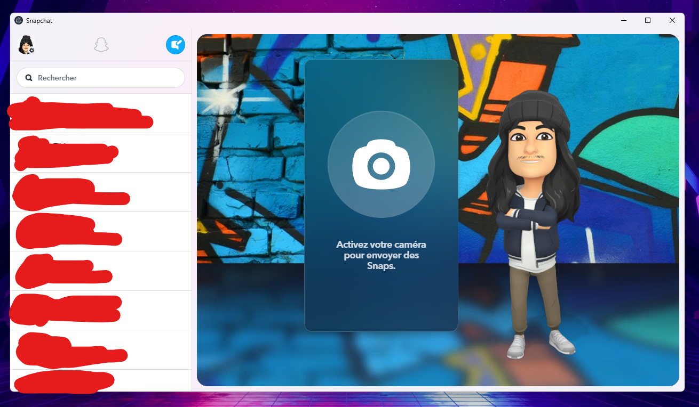

<h1 align=center>Mica-Snap</h1>
<div align=center>
<br>
<b>Mica-Snap</b> is SnapChat app with mica effect for windows 11.<br>
This is created by <a href="https://www.youtube.com/gregvido">GregVido</a>.
</div>
<hr>

## Usage

```sh
npm i
npm start
```

## Error compiling ?

```sh
npm run rebuild
```